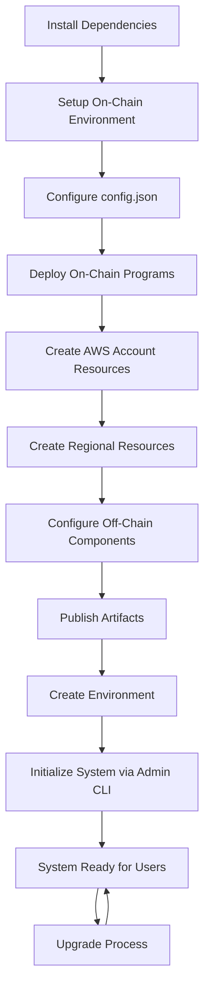

# DoubleZero Fee Conversion System - Deployment Guide

## Overview
The DoubleZero Fee Conversion System consists of both on-chain (Solana blockchain) and off-chain (AWS cloud) components. This guide provides step-by-step instructions to build and deploy the complete system.

This system consists of following components.

1. On-chain programs
   * Converter Program - Core On-chain program written in anchor, to handle the functionalities of the system.
   * Mock Double Zero Transfer Program - On-chain program written in anchor to mock the transfer functionality.
     It provides CPIs which is used by converter program to simulate actual transfer.
2. Off-chain components
   * Swap-oracle-service
   * Indexer-service
   * Matrix Api
3. CLI Tools
   * Admin CLI - CLI interface for admins to control the system.
   * User CLI - CLI interface for user to interact with the system.
4. Testing
   * E2E Test Suite - End-to-end tests for the system using the solana local test validator.

## System Dependencies

Ensure you have the following software versions installed:

### Core Dependencies
- **Node.js**: v22.17.0
- **Rust**: 1.88.0
- **Solana CLI**: 2.2.20
- **Anchor Framework**: 0.31.1
- **TypeScript**: ^5.9.2
- **Python**: 3.12.3

### Infrastructure Tools
- **Terraform**: v1.12.2
- **AWS CLI**: v2.18.12
- **Docker**: v28.3.3
- **jq**: 1.7


### Installation Commands
```bash
# Solana CLI
sh -c "$(curl -sSfL https://release.anza.xyz/v2.2.20/install)"

# Anchor (requires avm - Anchor Version Manager)
avm use 0.31.1

# Rust
rustup default 1.88.0

# Configure Solana for local development
solana config set -ul
```

### Setting up the AWS
export `AWS_ACCESS_KEY_ID` and `AWS_SECRET_ACCESS_KEY`

```bash

export AWS_ACCESS_KEY_ID=
export AWS_SECRET_ACCESS_KEY=

```

## Main Provision Script Usage
```bash
./provision.sh [OPTIONS]
```

##### Available Workspaces (`-w, --workspace`):
- `deployment` - Deploy infrastructure components
- `on-chain` - Deploy on-chain programs
- `admin-cli` - Build admin CLI
- `user-cli` - Build user CLI
- `integration-cli` - Build integration CLI
- `mock-double-zero-program` - Deploy mock program
- `run-tests` - Execute test suites

## Phase 1: On-Chain Component Deployment


### Environment Setup

#### Configure Local Validator
```bash
# Start local validator (if not running)
solana-test-validator

# Subscribe to logs (separate terminal)
solana logs -ul
```

### Solana Keypair Management

#### Generate Programs key
```bash
# Create keys directory
mkdir -p on-chain/.keys
mkdir -p mock-double-zero-program/.keys

# Generate keypair for converter program
solana-keygen new -o on-chain/.keys/converter-program-keypair.json

# Generate keypair for mock double zero program
solana-keygen new -o mock-double-zero-program/.keys/mock-double-zero-program-keypair.json

```

##### Generate Data signer key
```bash
# Install Python dependencies
pip install solders base58

# Generate new keypair
cd deployment/script
python3 script.py

# Or load existing keypair
python3 script.py <keypair.json>
```
This Script give
- Public Key
- Base58 Secret Key

Update the `oracle_pubkey` with `Public key` in config.json  
This keypair is used for signing price data in the swap-oracle service.

> [!NOTE]
> `Base58 secret Key` used by swap-oracle service we have to update it in parameter store when environment setup done.

### On Chain Configuration Setup

Create `config.json` at the project root with the following structure:

```json
{
  "rpc_url": "http://127.0.0.1:8899",
  "program_id": "9DRcqsJUCo8CL2xDCXpogwzLEVKRDzSyNtVgXqsXHfDs",
  "double_zero_program_id": "8S2TYzrr1emJMeQ4FUgKhsLyux3vpMhMojMTNKzPebww",
  "oracle_pubkey": "3FsydTFGUYNQJH7hx97wJiVYhtiDK3gx4ujXNyf1t8Rj",
  "sol_quantity": 25000000000,
  "slot_threshold": 134,
  "price_maximum_age": 324,
  "price_oracle_end_point": "https://clic19jsil.execute-api.us-east-1.amazonaws.com/dev4/api/v1/swap-rate",
  "coefficient": 4500,
  "max_discount_rate": 5000,
  "min_discount_rate": 500
}
```

#### Key Configuration Parameters:
- **program_id**: Public key of the main converter program (which is created by earlier step Generate Programs key )
- **double_zero_program_id**: Public key of the mock transfer program (which is created by earlier step Generate Programs key )
- **sol_quantity**: Amount of SOL per transaction (in Lamports)
- **coefficient**: Discount calculation curve coefficient (see formula below)
- **price_oracle_end_point**: swap-oracle-service endpoint which is created after environment creation( used by User cli to get swap rate. So doesnt need to be set at deployment to blockchain)


#### Coefficient Calculation Formula:

$$
\gamma = \frac{D_{max} - D_{min}}{N} * 10000
$$

Where:
- $N$: Desired number of slots between trades where the discount rate changes from $D_{min}$ to $D_{max}$
- $D_{max}$: Maximum discount rate (basis points)
- $D_{min}$: Minimum discount rate (basis points)

Example:

$D_{max}$ = 5000 (50%)\
$D_{min}$ = 500 (5%)\
$N$ = 432,000 (1 epoch)

$$
\gamma = \frac{5000 - 500}{432000} \approx 0.01042
$$
The coefficient is then multiplied by 10,000 to get the final coefficient. This is done to avoid floating point precision issues and preserve the precision of coefficient.

$$
\gamma * 10000 \approx 104
$$

In the above example, considering that the $N$ is 432,000, the coefficient is approximately $1.042 \times 10^{-6}$. To account for this precision, we have set the maximum coefficient value to 8 decimal places. (6 + 2 decimal places for added precision)

## Phase 1: On-Chain Component Deployment

### Deploy On-Chain Programs

> [!NOTE]
> Before deploy the program make sure you configure anchor correctly in both convertor program and mock double zero program. [Refer](#generate-data-signer-key).

check the `Anchor.toml`
#### Converter program
```bash 
[programs.localnet]
converter_program = "9DRcqsJUCo8CL2xDCXpogwzLEVKRDzSyNtVgXqsXHfDs" # update public key of the program

[provider]
cluster = "localnet"  # point to correct cluster (Devnet, Mainnet) 
wallet = "~/.config/solana/id.json"  # Check this file point to actual network


```

#### Mock double zero program
```bash

[programs.localnet]
mock_transfer_program = "8S2TYzrr1emJMeQ4FUgKhsLyux3vpMhMojMTNKzPebww"  # update public key of the program

[registry]
url = "https://api.apr.dev"

[provider]
cluster = "localnet" # point to correct cluster (Devnet, Mainnet) 
wallet = "~/.config/solana/id.json" # Check this file point to actual network

```


#### Option A: Manual Deployment
```bash
# Deploy converter program
anchor build && anchor deploy --program-name converter-program --program-keypair <keypair file path>

# Deploy mock double zero program
anchor build && anchor deploy --program-name mock-double-zero-program --program-keypair <keypair file path>
```

#### Option B: Automated Deployment
Ensure you have generated the keypair in the `.keys` folder. [See Solana Keypair Management](#solana-keypair-management)
```bash
# Deploy on-chain workspace
./provision.sh -w on-chain --restart-validator

# Deploy mock program
./provision.sh -w mock-double-zero-program --restart-validator
```
Note: Only use `--restart-validator` flag for local test environments. For devnet or mainnet deployments, omit this flag as you cannot restart public network validators.

### 1.4 Export Private Key
```bash
# Export your wallet private key as environment variable
export PRIVATE_KEY=226,222,1,3...
```
**Note**: Ensure this account has sufficient SOL for transactions.

## Phase 2: Off-Chain Component Deployment

## 2.1 Configuration Management

Off-chain components use the `config` npm module where the environment name and config file name must match exactly.

#### Environment-Config Mapping:
- Environment: `dev1-test` → Config file: `dev1-test.json`
- Environment: `production` → Config file: `production.json`

> [!NOTE]
> If there is no configuration for the environment application, take default.json as the configuration file..

## 2.2 Component Configurations

#### Indexer Service Configuration
Create config file: `indexer-service/config/{env-name}.json`
```json
{
   "applicationPort": 8080,
   "rpcUrl": "https://api.devnet.solana.com",
   "programId": "program_id",
   "concurrency": 8,
   "logLevel": "WARN"
}
```
**Note** Update `PROGRAM_ID ` with public key of the convertor program [Refer](#generate-data-signer-key).

#### Swap Oracle Service Configuration
Create config file: `swap-oracle-service/config/{env-name}.json`
```json
{
   "applicationPort": 8080, 
   "priceCacheTTLSeconds": 30,
   "logLevel": "INFO",
   "maxConfidenceRatio":  0.007,
   "pricingServices": [
     {
      "name": "pyth",
      "type": "pyth", 
      "endpoint": "https://hermes.pyth.network",
      "priceFeedIds": {
        "SOL/USD": "0xef0d8b6fda2ceba41da15d4095d1da392a0d2f8ed0c6c7bc0f4cfac8c280b56d",
        "2Z/USD": "0x879551021853eec7a7dc827578e8e69da7e4fa8148339aa0d3d5296405be4b1a"
      }
    }
  ]
}
```

## 2.3 Infrastructure Deployment Sequence

###  Initial Setup (One-Time)

Before create any resources, configure the AWS foundation:

```bash
# Navigate to the script directory
cd deployment/script

# Run one-time setup for your target region
./one_time_setup.sh us-east-1
```
**What this does:**
- Creates Terraform state S3 bucket: `doublezero-terraform-state-{account-id}`
- Configures bucket security settings (versioning, KMS encryption, access blocking)
- Sets up IAM policies and resource tagging for governance

### Deployment Sub-Commands (`-sc, --sub-command`):
When using `--workspace deployment`, specify one of:
- `account` - Manage account-level resources
- `regional` - Manage regional resources
- `environment` - Manage environment-specific resources
- `release` - Manage releases and artifacts

##### Available Actions (`-a, --action`):
- `create` - Create new resources
- `destroy` - Destroy existing resources
- `publish-artifacts` - Build and publish artifacts
- `upgrade` - Upgrade existing environment with new release tag
- `publish-and-upgrade` - Publish artifacts then upgrade environment
- `help` - Show command-specific help

##### Additional Options:
- `--region` - AWS region (e.g., `us-east-1`, `us-west-1`, `us-west-2`)
- `--env` - Environment name (e.g., `dev1-test`, `staging`, `production`)
- `--release-tag` - Release tag for artifacts (e.g., `dev1-test-v5.2.1`, `v1.0.0`)
- `-h, --help` - Show help information

### Step 1: Create Account-Level Resources
```bash
./provision.sh -w deployment -sc account -a create --region <region>
```
**Creates**: IAM roles, shared resources across all regions/environments

### Step 2: Create Regional Resources
```bash
./provision.sh -w deployment -sc regional -a create --region <region>
```
**Creates**:
- VPC and networking
- Security groups
- Load balancers
- ECR repositories
- CloudWatch log groups

### Step 3: Artifact Publishing

#### Publish Application Artifacts
```bash
./provision.sh -w deployment -sc release -a publish-artifacts --region <region> --release-tag <release-tag>
```
**Actions**:
- Builds Docker images for all services
- Tags images with release tag
- Pushes to ECR repositories
- Creates deployment artifacts

### Step 4: Environment Creation

#### Deploy Environment with Artifacts
```bash
./provision.sh -w deployment -sc environment -a create --env <env> --region <region> --release-tag <release-tag>
```
**Creates**:
- ECS/EC2 instances
- Environment databases
- Application load balancers
- Auto Scaling Groups
- Deploys applications with specified release tag


> [!NOTE]
> Update AWS Parameter Store value of `<env>/double-zero/oracle-pricing-key` with the Base58 encoded secret key. [Refer](#generate-data-signer-key).

## Phase 3: System Operations

### 3.1 Application Upgrades

#### Upgrade Existing Environment
```bash
./provision.sh -w deployment -sc release -a publish-and-upgrade --env <env> --region <region> --release-tag <release-tag>
```
**Process**:
1. Publishes new artifacts
2. Updates launch templates
3. Triggers rolling deployment
4. Validates deployment success

### 3.2 Environment Management

#### Environment Cleanup
```bash
# Destroy environment
./provision.sh -w deployment -sc environment -a destroy --env <env> --region <region> 

# Destroy regional resources  
./provision.sh -w deployment -sc regional -a destroy --region <region>
```
# Phase 4: CLI Usage

## 4.1 Admin CLI Operations

The Admin CLI provides comprehensive system management capabilities. All commands should be run from the project root directory.

### Initial System Setup

#### 1. Initialize the System
Initializes the system by creating the configuration registry, fills_registry, deny_list_registry and program state account.
```bash
cargo run -p admin-cli -- init
```

### Configuration Management

#### 1. View Configuration
Displays current configuration registry contents.
```bash
cargo run -p admin-cli -- view-config
```

#### 2. Update Configuration
Updates the configuration of the system. The command reads the `config.json` file and updates the configuration according to the values in the file.
```bash
cargo run -p admin-cli -- update-config
```

### System State Management

#### 1. View System State
Displays current system state.
```bash
cargo run -p admin-cli -- view-system-state
```

#### 2. Activate or Pause System
Controls system operation state. When paused, no new trades can be executed.
```bash
# Activate the system
cargo run -p admin-cli -- toggle-system-state --activate

# Pause the system
cargo run -p admin-cli -- toggle-system-state --pause
```

### Authority Management

#### 1. Set Admin
Sets the admin of the system. Only the program deployer can set/change the admin.
```bash
cargo run -p admin-cli -- set-admin -a <ADMIN_ACCOUNT>
```
- `-a`: Admin account public key

#### 2. Set Deny Authority
Sets the deny authority of the system.
```bash
cargo run -p admin-cli -- set-deny-authority -a <DENY_AUTHORITY_ACCOUNT>
```
- `-a`: Deny authority account public key

#### 3. Set Fills Consumer
Sets fill consumer public key in the configuration registry.
```bash
cargo run -p admin-cli -- set-fills-consumer -a <FILL_CONSUMER_ACCOUNT>
```
- `-a`: Fill consumer's public key

### Deny List Management

#### 1. Add to Deny List
Adds an address to the deny list registry.
```bash
cargo run -p admin-cli -- add-to-deny-list -a <USER_ACCOUNT>
```
- `-a`: User account public key

#### 2. Remove from Deny List
Removes an address from the deny list registry.
```bash
cargo run -p admin-cli -- remove-from-deny-list -a <USER_ACCOUNT>
```
- `-a`: User account public key

#### 3. View Deny List
Displays all addresses in the deny list registry.
```bash
cargo run -p admin-cli -- view-deny-list
```

### Registry Monitoring

#### 1. View Fill Registry
Views the Fills Registry, which tracks individual fill records and overall aggregate statistics.
```bash
cargo run -p admin-cli -- view-fill-registry
```


---
## Mock Token Program
### Init Mock Token Program
Initializes Mock token Program Accounts
```sh
cargo run -p admin-cli -- init-mock-program
```

### Airdrop to Mock Journal
Sends a specified amount of SOL to Mock Journal
```sh
cargo run -p admin-cli -- airdrop-to-mock-journal -a <AMOUNT>
```
- `AMOUNT`: SOL amount to be airdropped.


### Mock Token Mint
Mints Mock 2Z token to a specified address.
```sh
cargo run -p admin-cli -- mock-token-mint -a <AMOUNT> -t <DESTINATION_TOKEN_ACCOUNT>
```

- `-a`: Token Amount to be minted
- `-t`: Destination token account address. (Optional, If not specified, defaults to signer's Associated Token Account)

### Mint to Protocol Treasury Token Account
Mints specified amount of Mock 2Z token to protocol Treasury Account
```sh
cargo run -p admin-cli -- mint-to-mock-protocol-treasury -a <AMOUNT>
```
- `-a`: 2Z Token amount to be minted.

---


### 4.2 User CLI Operations

### Get Current Price
Calculates the current discount rate and estimates the ask price (in 2Z tokens) for the given SOL quantity.

```bash
cargo run -p user-cli -- get-price
```

### Get Current Quantity
Displays the current SOL quantity that can be purchased by spending 2Z tokens.
```bash
cargo run -p user-cli -- get-quantity
```

### Buy SOL
Initiates SOL purchase. Trade executes at bid price if ask price ≤ bid price; otherwise cancels.

```bash
cargo run -p user-cli -- buy-sol -p <bid_price> -f <SOURCE_ACCOUNT>
```

- `-p`: User's maximum acceptable purchase price
- `-f`: Source token account address. (Optional, If not specified, defaults to signer's Associated Token Account)

### Get Fills Info
View Fills Registry, which tracks individual fill records and overall aggregate statistics
```bash
cargo run -p user-cli -- get-fills-info 
```

## Integration CLI
### Dequeue Fills
Dequeues fills up to specified SOL amount. Returns total SOL and 2Z amounts processed. Only callable by authorized integrating contracts.

```bash
cargo run -p integration-cli -- dequeue-fills -a <max_sol_amount>
```

- `-a`: Maximum SOL amount to dequeue in this operation


## Metrics API Usage Examples

The DoubleZero system exposes metrics through RESTful APIs. Below are sample API calls to retrieve system metrics.

Replace the `INVOKE_URL` based on your deployment environment. You can get it from **AWS Console > API Gateway > Stages**.

#### Get Buys Metrics
Retrieve bucketed buy transaction counts for a date range:

```bash
# Get daily buys for August 2025
curl -X GET "<INVOKE_URL>/api/v1/metrics/buys?from=2025-08-01&to=2025-08-02" -H "Accept: application/json"

# Response example:
{
  "from": "2025-08-01",
  "to": "2025-08-02", 
  "data": [
    {
      "bucket": "2025-08-01",
      "start": "2025-08-01T00:00:00Z",
      "end": "2025-08-02T00:00:00Z",
      "buys": 19
    }, 
    {
      "bucket": "2025-08-02", 
      "start": "2025-08-02T00:00:00Z",
      "end": "2025-08-03T00:00:00Z",
      "buys": 14
    }
  ]
}
```

#### Get Dequeue Metrics
Retrieve dequeue event counts and SOL amount aggregates:

```bash
# Get daily dequeue metrics for August 2025
curl -X GET "<INVOKE_URL>/api/v1/metrics/dequeues?from=2025-08-01&to=2025-08-02" 
     -H "Accept: application/json"
```

## OnChain Testing

### Unit Tests
```bash
./provision.sh -w run-tests --test-type unit
```

### End-to-End Tests
```bash
./provision.sh -w run-tests --test-type e2e

# Or manual setup
cd e2e
npm install
./test_runner.sh --test-type e2e
```

## Deployment Flow Diagram



## Troubleshooting

### Common Issues:
1. **Keypair Issues**: Ensure keypairs are properly generated and funded
2. **Configuration Mismatches**: Verify environment names match config file names exactly
3. **AWS Permissions**: Ensure AWS CLI has proper permissions for Terraform operations
4. **Version Conflicts**: Use exact versions specified in dependencies

### Support:
- Check Solana logs: `solana logs -ul`
- Review AWS CloudWatch logs for off-chain components
- Validate configurations before deployment
- Test in local environment before deploying to AWS

## Migration Support

1. **Define new state structs**  
   Create new structs for your upgraded accounts (e.g., `NewConfigurationRegistry`, `NewProgramState`) and update the program code to use them.

2. **Add new seed definitions**  
   Create a new file under `on-chain/programs/converter-program/src/common/seeds/`, similar to `seed_prefix_v1.rs`, and define your new seeds there.
- If an account needs changes, introduce a new seed prefix.
- If the account is unchanged, reuse the existing seed.

3. **Update default seed profile**  
   Modify `on-chain/programs/converter-program/src/common/seeds/seed_prefixes.rs` to point the default profile to the new version.

4. **Implement migration logic**  
   Add a new migration handler (e.g., `on-chain/programs/converter-program/src/migration/migrate_v1_to_v2.rs`) to define the migration rules between versions.

5. **Run the migration**  
   Execute the migration instruction from your off-chain client to upgrade on-chain accounts.

6. **(Optional) Define rollback**  
   If rollback support is required, implement a reverse migration function as well.