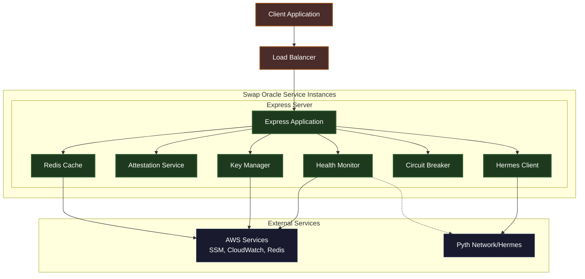
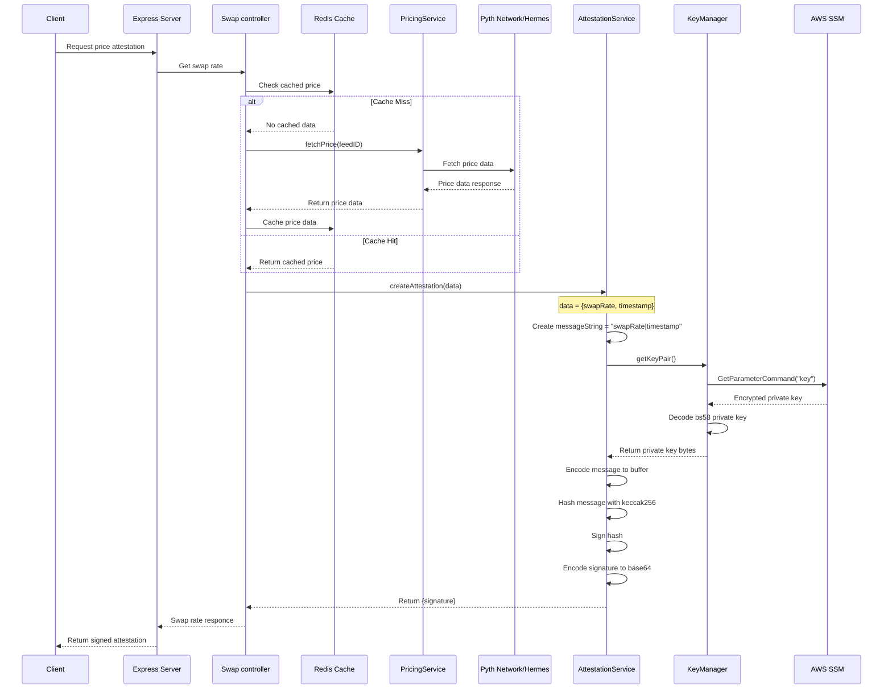
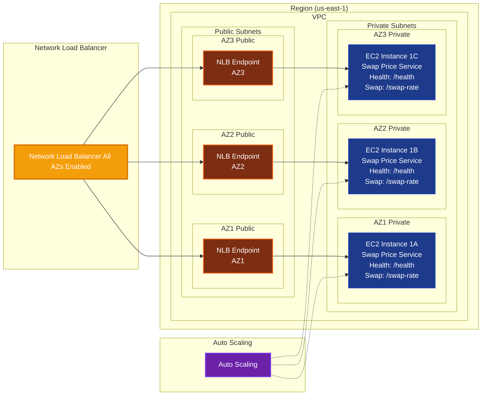

# System components

```mermaid
    graph TB
        %% External Services
        subgraph "External Services"
            Pyth[Pyth Network/Hermes]
            AWS[AWS Services<br/>SSM, CloudWatch, Redis]
        end
    
        %% Load Balancer & Client
        Client[Client Application]
        LB[Load Balancer]
        
        %% Main Application Instances
        subgraph "Swap Oracle Service Instances"
            subgraph "Express Server"
                ExpressApp[Express Application]
                Cache1[Redis Cache]
                Signer1[Attestation Service]
                KeyMgr1[Key Manager]
                Hermes1[Hermes Client]
                Health1[Health Monitor]
                CB1[Circuit Breaker]
            end
        end
    
    
        %% Connections
        Client --> LB
        LB --> ExpressApp
        
        %% Internal Express Server connections
        ExpressApp --> Cache1
        ExpressApp --> Signer1
        ExpressApp --> KeyMgr1
        ExpressApp --> Health1
        ExpressApp --> CB1
        
        %% Cache connections
        Cache1 --> AWS
        
        %% External service connections
        Hermes1 --> Pyth
        Health1 --> AWS
        KeyMgr1 --> AWS
        ExpressApp --> Hermes1
    
        %% Circuit breaker protection
        Health1 -.-> Pyth
    
        %% Styling
        classDef external fill:#1a1a2e,stroke:#16213e,stroke-width:2px,color:#ffffff
        classDef server fill:#1e3a1e,stroke:#2d5a2d,stroke-width:2px,color:#ffffff
        classDef client fill:#4a2c2a,stroke:#8b4513,stroke-width:2px,color:#ffffff

    
        class Pyth,AWS external
        class ExpressApp,Signer1,KeyMgr1,Hermes1,Health1,CB1,Cache1 server
        class Client,LB client
```

# Data flow from price fetch to signed attestation

```mermaid
sequenceDiagram
    participant Client
    participant Express as Express Server
    participant SwapController as Swap controller
    participant Cache as Redis Cache
    participant PS as PricingService
    participant Pyth as Pyth Network/Hermes
    participant AS as AttestationService
    participant KM as KeyManager
    participant AWS as AWS SSM
    
    Client->>Express: Request price attestation
    Express ->> SwapController: Get swap rate
    SwapController->>Cache: Check cached price
    
    alt Cache Miss
        Cache-->>SwapController: No cached data
        SwapController->>PS: fetchPrice(feedID)
        PS->>Pyth: Fetch price data
        Pyth-->>PS: Price data response
        PS-->>SwapController: Return price data
        SwapController->>Cache: Cache price data
    else Cache Hit
        Cache-->>SwapController: Return cached price
    end
    
    SwapController->>AS: createAttestation(data)
    Note over AS: data = {swapRate, timestamp}
    
    AS->>AS: Create messageString = "swapRate|timestamp"
    AS->>KM: getKeyPair()
    KM->>AWS: GetParameterCommand("key")
    AWS-->>KM: Encrypted private key
    KM->>KM: Decode bs58 private key
    KM-->>AS: Return private key bytes
    
    AS->>AS: Encode message to buffer
    AS->>AS: Hash message with keccak256
    AS->>AS: Sign hash
    AS->>AS: Encode signature to base64
    
    AS-->>SwapController: Return {signature}
    SwapController -->> Express: Swap rate responce
    Express-->>Client: Return signed attestation
   
```

# High availability deployment considerations

```mermaid

graph LR

    %% Single Region Setup
    subgraph "Region (us-east-1)"
        subgraph "VPC"
            subgraph "Public Subnets"
                subgraph "AZ1 Public"
                    NLB_AZ1[NLB Endpoint<br/>AZ1]
                end
                subgraph "AZ2 Public"
                    NLB_AZ2[NLB Endpoint<br/>AZ2]
                end
                subgraph "AZ3 Public"
                    NLB_AZ3[NLB Endpoint<br/>AZ3]
                end

            end
            
            subgraph "Private Subnets"
                subgraph "AZ1 Private"
                    EC2_1A[EC2 Instance 1A<br/>Swap Price Service<br/>Health: /health<br/>Swap: /swap-rate]
                end
                
                subgraph "AZ2 Private"
                    EC2_1B[EC2 Instance 1B<br/>Swap Price Service<br/>Health: /health<br/>Swap: /swap-rate]
                end
                
                subgraph "AZ3 Private"
                    EC2_1C[EC2 Instance 1C<br/>Swap Price Service<br/>Health: /health<br/>Swap: /swap-rate]
                end
            end
        end
        
    end

    %% Network Load Balancer (spans all AZs)
    subgraph "Network Load Balancer"
        NLB[Network Load Balancer All AZs Enabled]
    end

    %% Auto Scaling Group
    subgraph "Auto Scaling"
        ASG[Auto Scaling]
    end

    %% NLB connections to all AZ endpoints
    NLB --> NLB_AZ1
    NLB --> NLB_AZ2
    NLB --> NLB_AZ3

    %% NLB endpoint to EC2 connections
    NLB_AZ1 --> EC2_1A
    NLB_AZ2 --> EC2_1B
    NLB_AZ3 --> EC2_1C

    %% Auto Scaling Group manages EC2 instances
    ASG -.-> EC2_1A
    ASG -.-> EC2_1B
    ASG -.-> EC2_1C
    

    %% Styling
    classDef compute fill:#1e3a8a,stroke:#1e40af,stroke-width:2px,color:#ffffff
    classDef network fill:#7c2d12,stroke:#ea580c,stroke-width:2px,color:#ffffff
    classDef nlb fill:#f59e0b,stroke:#d97706,stroke-width:3px,color:#ffffff
    classDef scaling fill:#6b21a8,stroke:#7c3aed,stroke-width:2px,color:#ffffff
    
    class EC2_1A,EC2_1B,EC2_1C compute
    class NLB_AZ1,NLB_AZ2,NLB_AZ3,NLB_AZ4,NLB_AZ5,NLB_AZ6 network
    class NLB nlb
    class ASG scaling
```